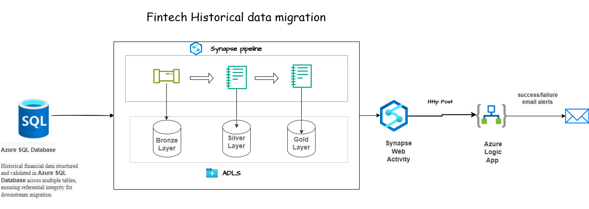
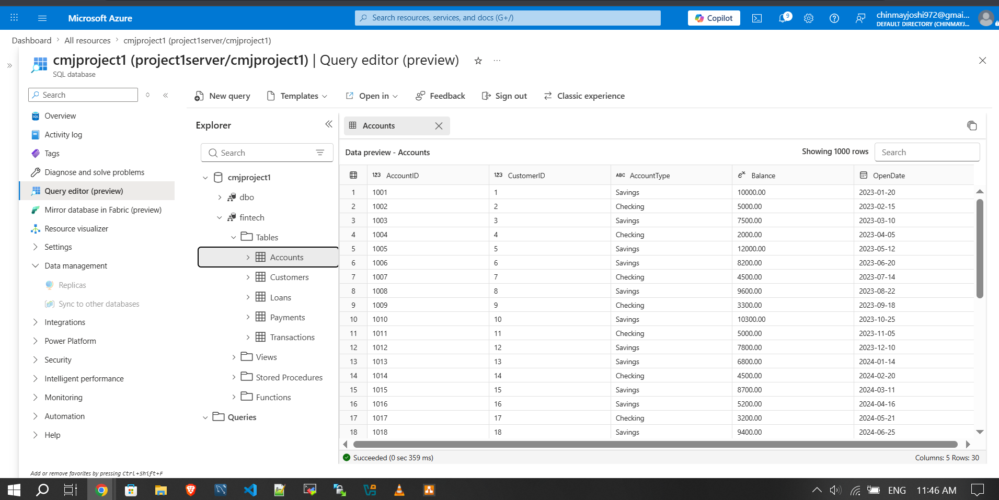
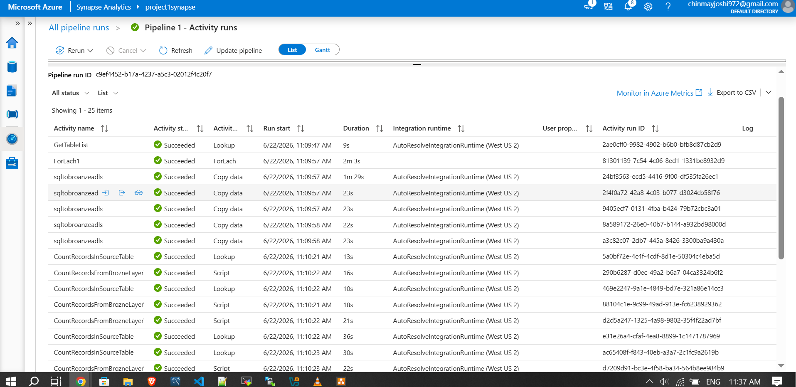
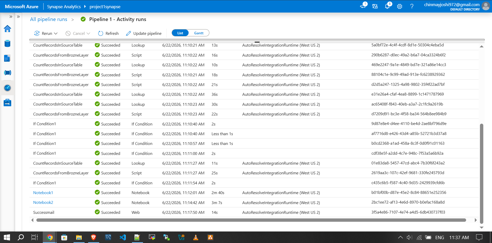
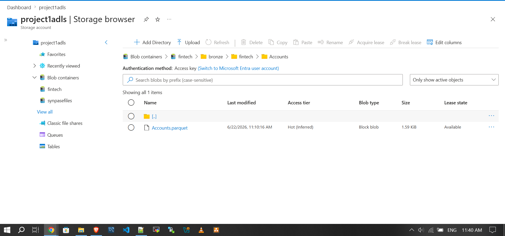
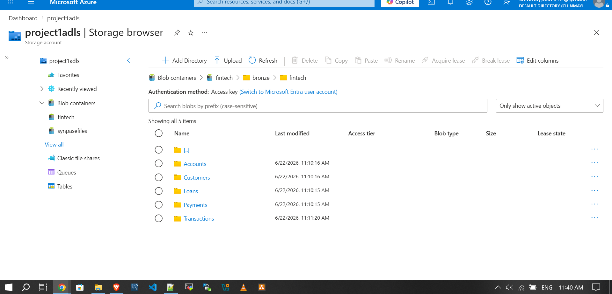
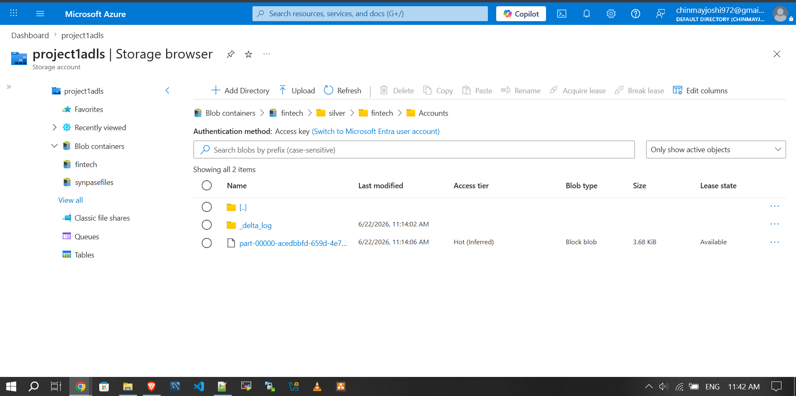
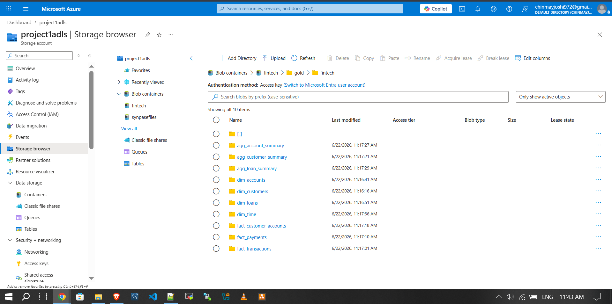
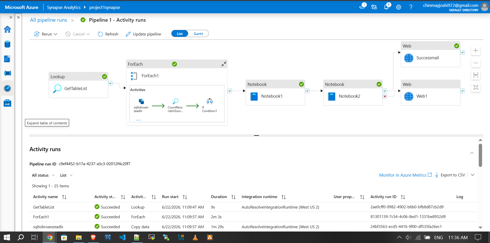
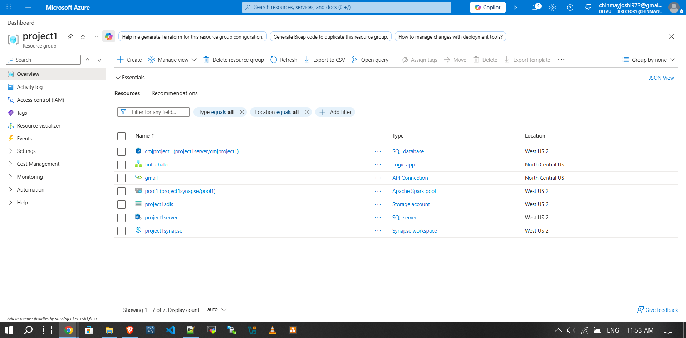

# FinTech-Data-Lake-Migration-on-Azure
Azure DE Project
# FinTech Data Lake Migration on Azure

Architected a metadata-driven Bronze-Silver-Gold data lake on **Azure** to modernize financial data processing and operational reporting using Synapse Pipelines, PySpark, Delta Lake, ADLS Gen2, Azure SQL Database, and Logic Apps. The solution automated end-to-end ETL orchestration, status monitoring, and success/failure notifications for a FinTech workload built on a scalable lakehouse-style architecture.

## Overview

This project demonstrates the migration of historical financial data from Azure SQL Database into a medallion-style data lake on ADLS Gen2. The design enables dynamic ingestion, layered transformation, analytics-ready gold datasets, and automated operational visibility through Azure Logic Apps email notifications.

## Architecture



The pipeline follows a Bronze-Silver-Gold pattern:

- **Source layer:** Azure SQL Database stores structured historical financial data across multiple tables.
- **Bronze layer:** Azure Synapse Pipeline ingests raw table data into ADLS Gen2 using dynamic and parameterized activities.
- **Silver layer:** PySpark notebooks cleanse, standardize, and enrich raw data before persisting Delta tables.
- **Gold layer:** Business transformations and aggregations generate analytics-ready curated tables.
- **Monitoring layer:** Synapse Web Activity triggers an Azure Logic App to send success/failure email alerts after execution.

## Business Goal

The objective was to modernize a FinTech data platform by moving MSSQL-based financial datasets into a cloud-native Delta Lake architecture. The solution improves scalability, lineage, downstream analytics readiness, and operational monitoring while reducing manual intervention in batch processing.

## Tech Stack

- Python
- SQL
- Azure SQL Database
- Azure Synapse Analytics
- Azure Data Lake Storage Gen2 (ADLS Gen2)
- PySpark
- Delta Lake / Delta Tables
- Azure Logic Apps

## Key Features

- Metadata-driven ingestion for multiple source tables.
- Bronze-Silver-Gold medallion architecture on ADLS Gen2.
- Dynamic linked services and parameterized Synapse pipelines.
- PySpark-based transformation and aggregation workflows.
- Delta table storage for optimized reliability and query performance.
- Automated HTTP-based pipeline status reporting.
- Success/failure alerting through Azure Logic Apps email notifications.
- End-to-end orchestration with built-in validation and error handling.

## Workflow

### 1. Source system setup
Historical financial data was created and validated in Azure SQL Database across multiple domain tables such as Accounts, Customers, Loans, Payments, and Transactions.



### 2. Dynamic ingestion to Bronze layer
A Synapse Pipeline uses lookup, foreach, copy, and validation activities to ingest source tables dynamically into the Bronze layer in ADLS Gen2.






### 3. Transformation to Silver layer
A PySpark notebook reads Bronze data, applies cleansing and standardization logic, and writes curated Delta tables into the Silver layer.



### 4. Aggregation to Gold layer
A second PySpark notebook performs business transformations and aggregations to publish analytics-ready Gold layer outputs.



### 5. Automated status reporting
After successful notebook execution, Synapse Web Activity triggers an Azure Logic App using an HTTP POST request to send pipeline execution notifications.



## Azure Resources Used

- Azure Synapse Workspace
- Apache Spark Pool
- Azure SQL Server and Azure SQL Database
- Azure Storage Account (ADLS Gen2)
- Azure Logic App
- API Connection for email notifications



## Data Assets Produced

### Bronze
Raw table-wise data landed in ADLS Gen2 for source preservation and traceability.

### Silver
Cleaned and standardized Delta tables were generated for downstream transformation and improved query consistency.

### Gold
Curated datasets such as account, customer, loan, payment, and transaction summaries were produced for analytics and reporting consumption.

## Sample Gold Outputs

- `agg_account_summary`
- `agg_customer_summary`
- `agg_loan_summary`
- `dim_accounts`
- `dim_customers`
- `dim_loans`
- `dim_time`
- `fact_customer_accounts`
- `fact_payments`
- `fact_transactions`

## Outcome

This project successfully modernized a FinTech data workflow from relational storage into a layered Delta Lake architecture on Azure. It enabled scalable ingestion, reliable transformations, analytics-ready gold datasets, and automated email-based operational visibility for pipeline execution status.

## Repository Structure

```bash
.
├── README.md
├── notebooks/
│   ├── bronze_to_silver.py
│   └── silver_to_gold.py
├── pipelines/
│   └── synapse_pipeline.json
├── sql/
│   └── source_schema.sql
└── images/
    ├── madallion-archi.jpg
    ├── source-db.jpg
    ├── activily-runs-1.jpg
    ├── activily-runs-2.jpg
    ├── sqltoparquetsuccess.jpg
    ├── sqltoparquetsuccess1.jpg
    ├── silver-success.jpg
    ├── gold-success.jpg
    ├── Fintechpipelinesuccess.jpg
    ├── all-resources.jpg
    └── project1.jpg
```

## README image links note

If these screenshots will be stored inside an `images/` folder in your GitHub repository, update image paths like this:

```md

```

For now, this README uses direct local filenames so it will work immediately when the images are uploaded alongside `README.md` in the same repository location.
